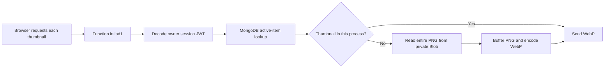

# Catalogue image performance analysis — 26 September 2026

The deployed thumbnail change reduces image bytes substantially, but the live measurements show that the remaining delay is dominated by waiting for image responses. Keep Blob as the storage system for now. Move thumbnail generation out of page requests, then improve caching or use direct signed CDN delivery depending on the required access behavior.

**What was measured**

The target was `https://www.stuff.yujitanaka.com/`. After the owner approved access to the Wardrobe tab, I captured a Chrome DevTools Performance reload trace and read the page's Resource Timing entries. The capture used the existing signed-in browser, a 1309 × 992 CSS-pixel viewport, device pixel ratio 2, no CPU/network throttling, and browser caching enabled. Existing extensions remained enabled.

Vercel CLI inspection and deployment metadata identified deployment `dpl_kJ1Qs78CSKn69UE7ozZrr4x2wUzG`, production commit `6231ae945264e5db12542abafc508ecbce85f5b8` (`improve loading performance by using thumbnails`), Node 24, and function region `iad1`. The deployed page requested `size=thumbnail`, and successful image responses were WebP. Local files changed during this investigation as separate pagination work proceeded; this report's live findings refer to that deployed commit, not those later edits.

The offline benchmark used all 15 approved cutouts in the first and second batch manifests. It ran three in-memory Sharp encodes for each image at each width, without changing or uploading the images. Source cutouts were 1024 × 1024 PNGs, ranging from 568,166 to 1,203,083 bytes. Offline encoding used native ARM64 Node 23.11.0 and Sharp 0.35.4; these CPU timings are not measurements of Vercel functions.

**Measured results**

| Metric | Observation | Meaning |
| --- | --- | --- |
| Image body bytes for all 15 live thumbnails | 732,102 bytes (0.732 MB) | The thumbnail change is active |
| First two eagerly requested images | 548–585 ms waiting; 156–157 ms receiving the body | Even the fast requests spend most of their time waiting |
| Remaining requests after lazy-image discovery | 569–3,329 ms waiting; 152–314 ms receiving the body | There is substantial variation before the first byte |
| Median wait across all 15 images | 3,119 ms | The slower requests dominate this particular capture |
| Median body download interval | 293 ms | Further compression alone cannot remove the multi-second waits |
| Sum of waits / sum of waits and body intervals | 89.6% | This is a per-request aggregate, not a page-load percentage |
| Image response cache policy | `private, no-store`; no ETag | Browser reuse and conditional 304 responses are unavailable |
| Application response routing | `hnd1::iad1` | Tokyo ingress, Washington D.C. function execution |
| Transport | HTTP/2 with reused connection on the two trace requests | Opening a new connection per image is not their bottleneck |
| Server timing breakdown | No `Server-Timing` header | The browser cannot identify which internal stage caused the wait |

The first two resource requests began around 552 ms after navigation and completed around 1.30–1.32 seconds. The other 13 requests were discovered around 8.31 seconds and finished by approximately 11.97 seconds. Do not interpret that 8-second discovery gap as a confirmed application defect: background-tab visibility, profiling, and browser interaction were not controlled. It is separate from the measured wait after each request was sent. A foreground repeat capture is needed to diagnose that gap reliably.

The saved Performance recording includes the first two completed image requests. Later Resource Timing readings include all 15; their numbers are saved separately. The first 1.79-second range selected in DevTools reported about 53 ms of first-party main-thread work and 188 ms from MetaMask. That shows extension noise and does not establish a clean-browser CPU baseline. LCP was unavailable in the recorded insights, so this report does not claim an LCP score.

| Local output | Total for 15 images | Reduction from PNGs | Average of per-image median encode times |
| --- | ---: | ---: | ---: |
| Original cutout PNGs | 12.080 MB | — | — |
| 320px WebP, quality 80 | 0.260 MB | 97.85% | 32.18 ms |
| 480px WebP, quality 80 | 0.468 MB | 96.12% | 46.86 ms |
| 640px WebP, quality 80 | 0.732 MB | 93.94% | 65.11 ms |
| 960px WebP, quality 80 | 1.424 MB | 88.22% | 106.40 ms |

These use the application's resize settings and alpha quality 100. The 640px aggregate exactly matches the observed live image-body total. The 480px version is another 36.0% smaller than 640px. At the measured card width of 233 CSS pixels and DPR 2, approximately 466 source pixels would suffice; larger cards or higher DPR can still justify 640px. A responsive choice is better than forcing 480px everywhere. Sharp's WebP options are documented in its [output API](https://sharp.pixelplumbing.com/api-output/).

**Why the current delivery path can still be slow**



The image route authenticates and performs a MongoDB lookup for each image, even on a thumbnail cache hit. Authentication uses a JWT session; it does not perform a new GitHub OAuth round trip for every photo. The Mongo client is reused inside an application process, which is already a useful optimization.

On a thumbnail cache miss, `src/lib/storage/thumbnail.ts` reads the whole stored PNG before sending any image bytes, then invokes Sharp. Across this catalogue that is 12.08 MB fetched into functions to create 0.732 MB of responses. The memory cache is limited to 16 MiB/128 images and is shared only within one process. The catalogue fits comfortably, but redeployment and other function instances do not share those buffers. The in-flight map combines duplicate requests for the same image only; it does not combine work across different images or processes.

The regional hop is confirmed; its precise contribution to latency is not. Database and Blob store regions were not verified. Move the application toward Japan only after checking those data regions, or a database round trip could become slower. Vercel recommends locating functions near their data sources in its [function-region guide](https://vercel.com/docs/functions/configuring-functions/region).

The image response's `x-vercel-cache: MISS` describes the application response. It does not tell us whether the function's upstream Blob read hit the Blob CDN. The adapter now enables private Blob cache reads, but upload code explicitly sets `cacheControlMaxAge: 60`, giving immutable files only a one-minute storage cache lifetime.

**Suggested work, in order**

1. **Generate and store thumbnail variants during import.** Store immutable WebP versions at 320/480/640px alongside the reviewed cutout and original. Backfill the existing 15 items from approved PNGs and verify the new objects before switching their references. This removes full-PNG reads, encoding, and dependence on a warm process from image requests. Version the transform in the pathname so changing quality produces a new object. The local benchmark supplies actual size targets; it does not predict the resulting live response time.

2. **Add timing measurements before making a regional or provider change.** Measure JWT authorization, database connection acquisition, database query, Blob response headers, Blob body consumption, Sharp encoding, and thumbnail cache hit/miss. Include separate durations in `Server-Timing` and record the deployment region. Blob-header time alone would miss a slow body stream. The header is specifically intended to expose backend timing in browser tools: [Server-Timing reference](https://developer.mozilla.org/en-US/docs/Web/HTTP/Reference/Headers/Server-Timing). Avoid adding private storage paths to these measurements.

3. **Choose browser caching that matches the access requirement.** For the authenticated proxy, `private, no-cache` plus a representation-specific ETag allows the browser to store bytes but requires revalidation. Check ownership and active-item status before returning 304. An ETag based on immutable image identity, size, and transform version can avoid Blob/Sharp work on a match; error responses should remain `no-store`. This keeps immediate denial for future requests after sign-out or removal, while avoiding repeat body downloads. Cached pixels already displayed cannot be retracted. Vercel documents this approach in [private Blob caching](https://vercel.com/docs/vercel-blob/private-storage#caching).

4. **Increase the upstream TTL for new immutable variants.** Use a substantially longer Blob cache lifetime, for example 30 days, instead of the adapter's 60 seconds. This setting is separate from browser caching. Uploading new variants with new keys makes the policy easy to apply; changing the default in code alone does not retroactively update existing objects. Longer storage caching is compatible with the proxy checking whether an item is active on every request.

5. **Evaluate direct signed Blob delivery as the faster architecture.** The installed `@vercel/blob` 2.8.0 exports `issueSignedToken()` and `presignUrl()`. Server-issued, expiring GET URLs allow the browser to fetch from the private Blob CDN without proxying the image bytes. Signing material should be cached server-side and reused; generating it independently for each image would add control-plane requests. Return only individual URLs for active items. Keep originals and signing secrets private. This capability is documented in [Vercel Signed URLs](https://vercel.com/docs/vercel-blob/vercel-signed-urls).

6. **Use responsive images and adjust first-viewport discovery.** Supply 320/480/640px choices with `srcset` and accurate `sizes`. The default Next.js optimizer does not forward session headers, so protected same-origin sources need a custom loader/component or pre-generated variants: [Next.js Image documentation](https://nextjs.org/docs/app/api-reference/components/image). The current rule eagerly loads two images regardless of viewport width; a desktop first row contains five. Test eager loading the first desktop row while prioritizing only the most important image, and retain lazy loading below the viewport. Chrome's guidance recommends eager loading visible images: [native lazy-loading guidance](https://web.dev/articles/browser-level-image-lazy-loading).

**Storage and delivery choices**

| Option | Work on an image request | Access behavior | Assessment |
| --- | --- | --- | --- |
| Current runtime thumbnail proxy | JWT + database + possibly PNG read/encode | Owner and active item checked every time | Useful first improvement, variable latency remains |
| Stored WebP through proxy, with ETag revalidation | JWT + database; stored WebP read on first fetch | Owner and active item checked every time | Preferred when immediate denial is required |
| Stored WebP through expiring signed Blob URLs | CDN serves bytes; authorization occurs when issuing URLs | URL holder can fetch until expiry | Most promising way to remove the application delivery hop |
| Public Blob URLs | CDN serves bytes | Anyone with the URL can read | Changes the private-wardrobe model |
| Another private CDN/object store | Depends on its signing/cache design | Depends on the chosen authorization design | No measured reason to migrate yet |

With signed URLs, signing out or hiding an item prevents issuing new URLs, but an already issued URL can remain usable until it expires. A proposed 60–120-second URL lifetime limits that window; cached local bytes can remain longer. This is an architectural tradeoff, not an equivalent replacement for per-request ownership checks. A page open longer than the lifetime also needs authenticated URL refresh for images not yet loaded. A redirect from the current image route would still retain a per-image function request, so returning the final URLs in the authorized catalogue response avoids more overhead. Direct delivery should be benchmarked with the stored WebPs, not the full-size PNGs.

My recommendation is to pre-generate thumbnails and add ETag revalidation first. If a brief URL access window after sign-out/removal is acceptable, trial direct signed Blob delivery next. There is currently no evidence that the Blob storage provider itself must be replaced. Pagination will help as the collection grows, but cannot remove the waits measured for the existing 15 image requests.

**Limits of this investigation and the next validation**

Chrome was used for other work during the attempted repeat capture, and computer-use control paused while it was active. No controlled repeat-load or throttled-mobile run was completed. The initial trace and later Resource Timing data are valid observations, but not a multi-run baseline. The 3-second waits are consistent with cold initialization, upstream I/O, or queueing; the capture cannot assign them specifically to MongoDB, Blob, or Sharp. Runtime logs were requested, but the connected Vercel logs API returned 403 and the local CLI's log/metric commands failed. No internal timing breakdown was available.

For validation, capture at least five foreground reloads plus one after idle, with the deployment held constant. Include desktop and phone viewports, normal and throttled networks, first and repeat visits, and filter/back navigation. Record time to the first visible image, all visible images, per-image wait/download intervals, transferred bytes, LCP, and internal stage timings. For a direct signed-URL trial, also verify URL expiry, old URLs after removal, delayed lazy loads, and stable CDN caching. Verify that unauthorized requests to the application still fail. Set performance budgets after obtaining that baseline; do not turn a local CPU benchmark into a promised production gain.

**Reproducible artifacts**

- `docs/performance/image-benchmark.json`: anonymous per-image size/encode measurements and aggregate totals.
- `docs/performance/browser-resource-timing.json`: all 15 observed Resource Timing measurements, with private IDs omitted.
- `docs/performance/trace-summary.json`: two requests completed inside the saved trace, including selected response headers.
- `scripts/profile-images.mjs`: offline size/encode profiler; sources are never modified or uploaded.
- `scripts/analyze-image-trace.mjs`: extracts only relevant timing/header data from a local DevTools trace.

```sh
node scripts/profile-images.mjs /private/tmp/image-benchmark.json \
  wardrobe-data/processed/first-batch/manifest.json \
  wardrobe-data/processed/second-batch/manifest.json

node scripts/analyze-image-trace.mjs \
  /private/tmp/wardrobe-reload-1.json.gz /private/tmp/trace-summary.json
```

The raw trace remains in temporary storage and is not included in the repository report. No signed URLs were minted, private objects uploaded, storage settings changed, or application deployment performed for this analysis.
